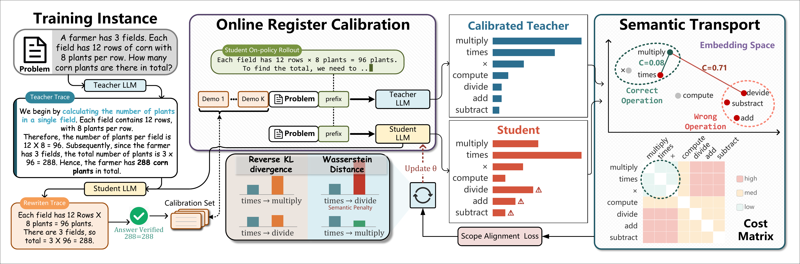
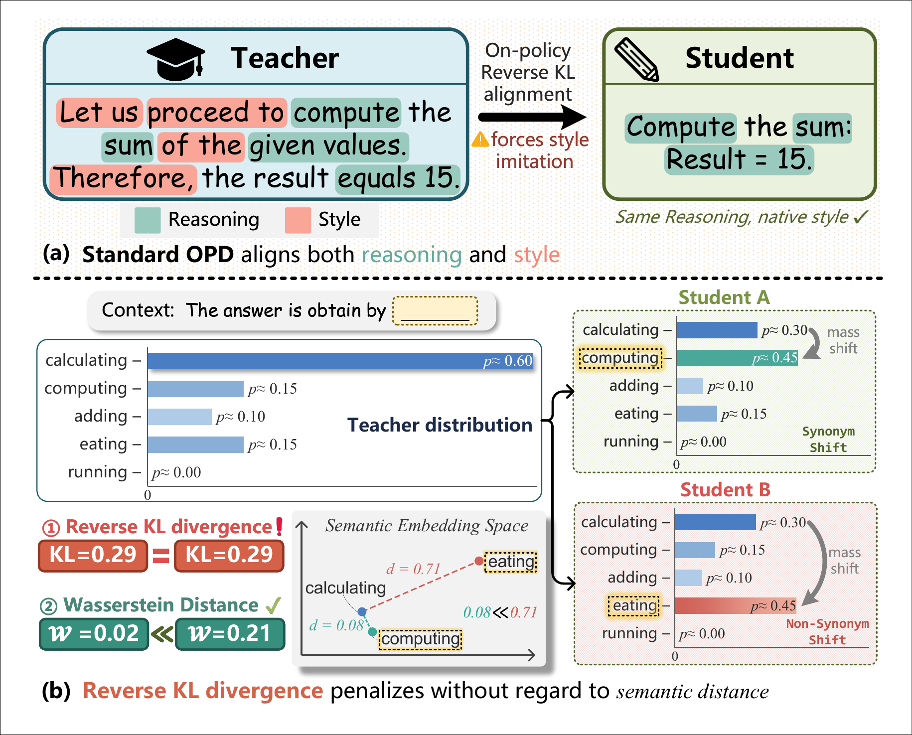

<div align="center">

# SCOPE

### Semantically Calibrated On-Policy Distillation

**Student-native teacher guidance and geometry-aware token alignment for reasoning distillation**

[](https://www.python.org/)
[](https://pytorch.org/)
[](https://huggingface.co/docs/transformers/)
[](https://huggingface.co/docs/trl/)
[](#release-scope)

</div>

<p align="center">
  
</p>

SCOPE is the official training implementation of **Semantically Calibrated On-Policy Distillation**. It makes on-policy reasoning distillation more student-centric along two complementary axes:

- **Register Calibration (RC)** rewrites teacher traces online in the evolving student's linguistic register, verifies answer consistency, and uses the accepted rewrites as privileged teacher context.
- **Semantic Transport (ST)** augments reverse KL with an embedding-grounded token-level Wasserstein regularizer, so semantically close and distant token shifts are treated differently.

The repository contains the core algorithm and training pipeline for a **Qwen3-1.7B student** and a frozen **Qwen3-8B teacher**. Models, generated trajectories, and benchmark evaluation assets are not redistributed.

## Why SCOPE?

Standard on-policy distillation fixes exposure bias by training on student-generated trajectories, but two teacher-centric biases remain:

| Limitation | What happens | SCOPE's response |
|---|---|---|
| **Stylistic contamination** | Direct teacher alignment also transfers teacher-specific vocabulary, syntax, and discourse patterns. | **Register Calibration** turns teacher traces into verified, student-native demonstrations. |
| **Semantic blindness** | Reverse KL compares token probabilities without considering relationships between tokens. | **Semantic Transport** prices probability shifts using distances in the student's embedding space. |

<p align="center">
  
</p>

## Method at a glance

SCOPE combines an offline preparation stage with an online distillation loop:

```text
Offline, once
  problem + reference solution
        └── frozen 8B teacher ──► teacher reasoning trace ──► save to disk

Online, every training step
  disjoint teacher trace
        └── current student rewrite ──► answer check ──► calibrated context

  target problem ──► student on-policy completion
        ├── student forward
        └── frozen teacher forward + calibrated context
                    └── RKL + λ · Semantic Transport ──► update student
```

The training objective is

<p align="center">
  <strong>L<sub>SCOPE</sub> = D<sub>KL</sub>(p<sub>S</sub> ∥ p<sub>T</sub>) + λ<sub>ST</sub> W<sub>ε</sub>(p<sub>S</sub>, p<sub>T</sub>; C<sub>E</sub>)</strong>
</p>

where C<sub>E</sub> is the cosine-distance ground cost computed from frozen pretrained student embeddings. To keep optimal transport tractable, the implementation constructs a union of the teacher and student top-K supports and solves the entropy-regularized transport problem with Sinkhorn iterations.

> **Naming note.** Code and scripts may use `OPD+RC` for Register Calibration and `OPD+ST` for the reverse-KL-plus-Semantic-Transport objective. The full pipeline is SCOPE.

## Installation

### Conda (recommended)

```bash
# From the cloned repository
cd SCOPE

conda env create -f environment.yml
conda activate scope
```

### Pip

```bash
python -m venv .venv
source .venv/bin/activate
pip install -r requirements.txt
```

The provided training launcher uses FlashAttention 2. Install `flash-attn` separately with a build compatible with your PyTorch/CUDA stack, or change `--attn_implementation` in `scripts/run_train_scope.sh`.

## Quick start

### 1. Generate offline teacher trajectories

The generator reads GSM8K by default, verifies final-answer consistency, supports checkpoint resume, and writes a Hugging Face dataset to disk.

```bash
TEACHER_MODEL=Qwen/Qwen3-8B \
OUTPUT_PATH=data/gsm8k_teacher_reasoning_qwen3_8b \
bash scripts/run_gen_teacher_reasoning.sh
```

To use a local dataset, invoke `scripts/gen_teacher_reasoning.py` with `--dataset_path`. Each example must expose a problem field (`problem`, `question`, or `Question`) and a solution field (`solution`, `answer`, or `Answer`). The generated dataset contains:

```text
problem | solution | teacher_reasoning
```

### 2. Train SCOPE

```bash
STUDENT_MODEL=Qwen/Qwen3-1.7B \
TEACHER_MODEL=Qwen/Qwen3-8B \
TEACHER_REASONING_DATA=data/gsm8k_teacher_reasoning_qwen3_8b \
OUTPUT_DIR=outputs/SCOPE \
bash scripts/run_train_scope.sh
```

Local Hugging Face model directories can be passed through `STUDENT_MODEL` and `TEACHER_MODEL`. Training uses LoRA for the student and keeps the separate teacher frozen.

### Memory-aware placement

The default setup loads both models on the accelerator. Two alternatives are built in:

```bash
# Keep the teacher on CPU. Slower, but reduces accelerator memory use.
TEACHER_ON_CPU=true bash scripts/run_train_scope.sh

# Pin the teacher to another visible GPU.
CUDA_VISIBLE_DEVICES=0,1 TEACHER_DEVICE=cuda:1 bash scripts/run_train_scope.sh
```

## Default configuration

| Group | Setting | Default |
|---|---|---:|
| Models | student / teacher | Qwen3-1.7B / Qwen3-8B |
| Optimization | learning rate | `5e-6` |
|  | effective batch size | `8` on one process |
|  | epochs | `1` |
| LoRA | rank / alpha | `64` / `128` |
| Generation | temperature / top-p / top-k | `1.0` / `0.95` / `20` |
| Sequence | completion / rewrite / total cap | `1024` / `1536` / `4096` |
| Semantic Transport | λ<sub>ST</sub> / top-k support | `0.1` / `32` |
|  | Sinkhorn ε / iterations | `0.05` / `20` |
|  | token interval | every `4` valid tokens |

See [docs/HYPERPARAMETERS.md](docs/HYPERPARAMETERS.md) for the full configuration and [docs/METHOD.md](docs/METHOD.md) for implementation details.

## Experiment tracking

Logging is disabled by default in the launcher. Enable Weights & Biases, SwanLab, or both:

```bash
LOG_WITH=wandb bash scripts/run_train_scope.sh
LOG_WITH=swanlab SWANLAB_PROJECT=SCOPE bash scripts/run_train_scope.sh
LOG_WITH=both bash scripts/run_train_scope.sh
```

When trace logging is enabled, SCOPE records the offline teacher trace, online calibrated rewrite, teacher distillation context, and student on-policy completion. Treat these artifacts as potentially sensitive if you train on private data.

## Repository layout

```text
SCOPE/
├── scope/
│   ├── trainer.py                 # online RC + dual-model training loop
│   ├── opd_st_loss.py             # RKL + token-level Sinkhorn transport
│   ├── data_collator.py           # student and privileged-teacher batches
│   ├── opd_rc_utils.py            # answer checks, retries, and fallbacks
│   ├── prompts.py                 # offline and online prompt templates
│   └── experiment_logging.py      # local/W&B/SwanLab logging
├── scripts/
│   ├── gen_teacher_reasoning.py   # resumable offline trajectory generation
│   ├── train.py                   # training CLI
│   ├── run_gen_teacher_reasoning.sh
│   └── run_train_scope.sh
├── docs/
│   ├── METHOD.md
│   └── HYPERPARAMETERS.md
├── environment.yml
└── requirements.txt
```

## Release scope

This release focuses on the training method. It does **not** include:

- pretrained or fine-tuned model checkpoints;
- pre-generated teacher trajectories or datasets;
- evaluation scripts, benchmark prompts, or paper result tables.

You are responsible for complying with the licenses and terms of the models and datasets you use.

## License

This repository is released under the [Apache License 2.0](LICENSE).

## Citation

Citation metadata will be added with the public paper release.
